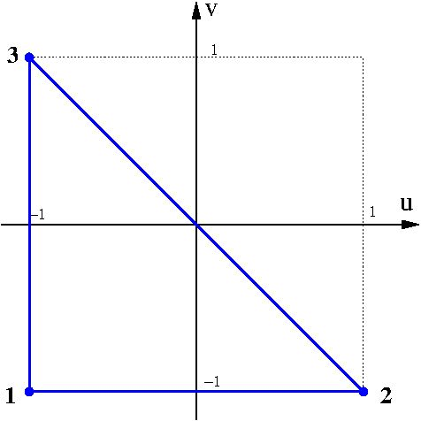
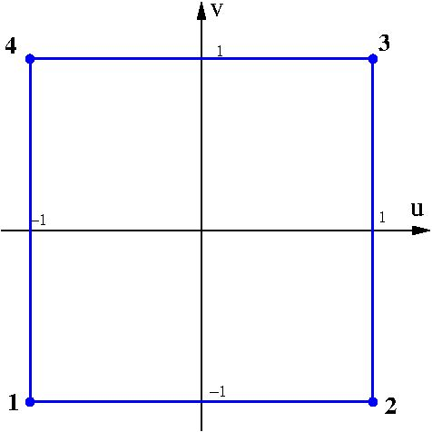
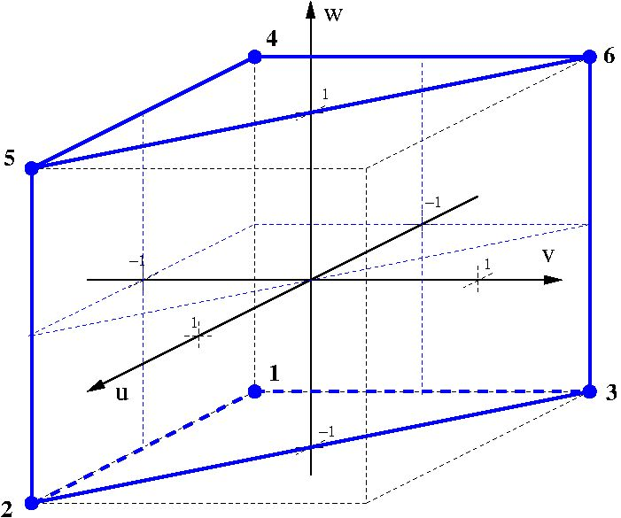
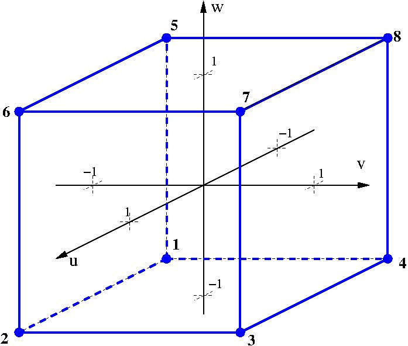
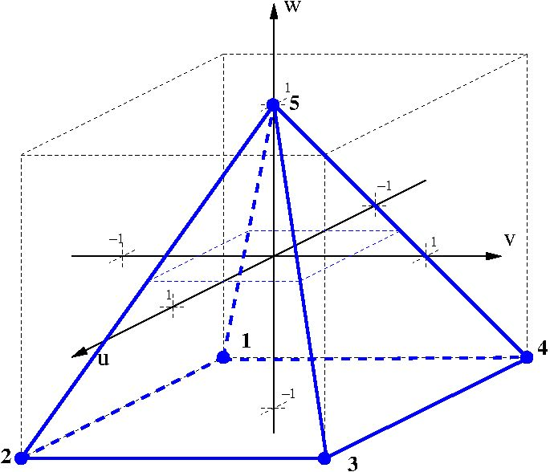

::: center
{width="25%"}\
**CGNS Proposal for Extension 0045**\
Storing Cell-Wise Polynomial Data and Generalising\
the Description of Curved Grid Elements\

------------------------------------------------------------------------

\
Version 3.0\
2026-05-08
:::

  ----------------------- ----------------------------------------------------------------
  **CPEX#**               0045
  **Scope**               High-order polynomial interpolation for elements and solutions
  **Champion**            Koen Hillewaert
  **Organization**        Cenaero
  **E-mail**              <koen.hillewaert@cenaero.be>
  **Date First Posted**   Mar. 26, 2019
  **Date of Revision**    May 4, 2026
  **SIDS Status**         accepted; implementation complete (v5.0)
  **Filemap Status**      accepted; implementation complete (v5.0)
  **MLL Status**          accepted; implementation complete (v5.0)
  ----------------------- ----------------------------------------------------------------

::: center
**Amendment to Approved Proposal**\
CPEX-0045 v2 was previously approved by the CGNS Steering Committee.
This document (v3) is submitted as a revision to that approved proposal.
The committee is asked to evaluate only the *delta* described below.
Passages reproduced from v2 are marked throughout with a blue left-rule
callout.
:::

- Two new SIDS node types: `ElementInterpolation_t` and
  `SolutionInterpolation_t`, both children of `Family_t`.

- `InterpolationType_t` enum with four values: `ParametricLagrange`,
  `ParametricMonomialsPascal`, `CartesianMonomialsPascal`,
  `IsoParametric`.

- Support for purely spatial and space-time interpolation via
  `SpatialOrder` and `TemporalOrder` fields.

- High-order solution data stored in existing `FlowSolution_t` nodes;
  polynomial orders recorded per solution block.

- Scope restricted to unstructured mesh computations.

Each item is labelled [**\[NEW\]**]{style="color: newgreen"} (genuinely
new; requires committee vote) or
[**\[CLARIFICATION\]**]{style="color: clarifybrown"} (formalises v2
intent; no semantic change to the approved standard).

*SIDS changes:*

1.  [**\[NEW\]**]{style="color: newgreen"}
    **`LagrangeControlPointDistribution_t` enum.** Records the
    parametric-space distribution of Lagrange control points. Values:
    `GaussLobattoLegendre`, `Equidistant`, `GaussLegendre`,
    `WarpAndBlend`. Stored as an optional named child of
    `ElementInterpolation_t` or `SolutionInterpolation_t`; required for
    `ParametricLagrange`. *Rationale:* a reader cannot reconstruct basis
    functions from control-point positions alone without this
    information.

2.  [**\[CLARIFICATION\]**]{style="color: clarifybrown"}
    **`GridLocation = InterpolationPoints`.** Designates
    `InterpolationPoints` as the required `GridLocation` for whole-zone
    high-order `FlowSolution_t` nodes. `CellCenter` with
    `PointRange`/`PointList` remains the convention for variable-order
    (p-adaptive) subsets, as implied by v2.

3.  [**\[CLARIFICATION\]**]{style="color: clarifybrown"}
    **`InterpolationOrders` encoding.** Formalises the on-disk
    representation of `SpatialOrder` and `TemporalOrder` as a 2-element
    `IndexArray_t` child of `FlowSolution_t`. Information content is
    identical to v2.

4.  [**\[NEW\]**]{style="color: newgreen"} **Mandatory coordinate
    normalisation for Cartesian modal.** Requires normalisation by the
    maximum inter-vertex distance $h^e$, which must be stored alongside
    modal coefficients. *Rationale:* high-order monomials in
    un-normalised physical coordinates cause catastrophic floating-point
    overflow at large or small element sizes.

*New normative sections (no equivalent in v2):*

- [**\[NEW\]**]{style="color: newgreen"} **Mid-Level Library API** ---
  complete C and Fortran 2003 read/write interface for all CPEX-0045
  node types, including `LagrangeControlPointDistribution` accessors.

- [**\[NEW\]**]{style="color: newgreen"} **SIDS File Mapping** --- exact
  on-disk array shapes, data types, and DOF-ordering conventions.

- [**\[NEW\]**]{style="color: newgreen"} **Implementation
  Specification** --- polynomial order limits, validation requirements,
  error-code semantics, and default values.

*Implementation evidence:* All v3 additions are implemented in the CGNS
library branch `CPEX45_high_order_wip`: C API (`cgnslib.c/h`), internal
readers (`cgns_internals.c`), Fortran bindings (`cgns_f.F90`), and
`cgnscheck` validation. C and Fortran test programs pass.

*Deferred to a future CPEX:* explicit symbolic representation of
individual interpolation functions (noted as a potential extension in
v2).

::: motionbox
**Motion.** The CGNS Steering Committee moves to adopt **CPEX-0045
version 3.0** (2026-05-08) as an amendment to the previously approved
v2, incorporating: (1) the `LagrangeControlPointDistribution_t` enum and
its associated child node; (2) `GridLocation = InterpolationPoints` for
whole-zone high-order solutions; (3) the `InterpolationOrders` child of
`FlowSolution_t` as the normative on-disk encoding; (4) mandatory
coordinate normalisation for Cartesian modal interpolation; and (5) the
Mid-Level Library API, SIDS File Mapping, and Implementation
Specification sections as normative components of the standard.

**Moved by:**\
**Seconded by:**\
**Vote:**  For: Against: Abstain: **Result:**
:::

# Motivation and Scope

::: v2quote
The aim is to cater for the large diversity of high-order methods by
including a specification of the interpolation spaces for solutions in
the file, fixing the bare essentials: the coordinate system. The choice
of Lagrangian interpolation spaces is applicable to the mesh as well as
the solution description. This generalisation will:

- allow accurate representation of data in a range of popular
  interpolation spaces which could otherwise only be approximated;

- allow use of the native storage of the application for the Lagrangian
  description, leading furthermore to

  - a simpler, more robust, and generic implementation of drivers;

  - more efficient I/O by straightforwardly dumping data blocks;

  - avoiding loss of precision for very specific point distributions;

- avoid the need to redefine the format for each new interpolation
  type/order;

- cater for space-time methods as well as for ALE computations by
  including time in the functional expressions.

Currently it is assumed that high-order intra-element interpolation is
*restricted to unstructured mesh computations*, as structured meshes do
not offer the possibility to individually list elements per order and
moreover do not support curved elements. Both modal and nodal
interpolations are supported.

There is clear potential for future extension via an explicit
specification of mathematical expressions of the individual
interpolation functions. This will increase the flexibility for modal
interpolation approaches.
:::

# Rationale

::: v2quote
This proposal lifts the limitation of fixing the interpolation functions
implicitly by imposing the position of Lagrange control points as
proposed for geometric interpolation/curved elements in CPEX 0036 and
CPEX 0038. Instead, the description of the functional space and its
interpolant is integrated as metadata in the CGNS file in order to allow
high flexibility as to the choice of interpolants or even coordinates,
an automatic procedure to allow for very high interpolation order, and
time-dependent interpolants.
:::

# Extension of the SIDS

## Conventions

::: v2quote
**Modifications to the SIDS:**

- addition of a new section 3.4: *High-order interpolation*.

In the remainder of this section we introduce the different paragraphs
(with numbering to be adapted) that should be added to the new section.
:::

::: v2quote
"The CGNS standard allows the user to specify their own interpolation
approach for both elements and solution. The basic principles are:

1.  The element coordinate system per element type is a fixed
    convention.

2.  For the solution interpolation per each element type and
    interpolation order, a separate interpolation block is added which
    provides one of three choices:

    - the set of control points for Lagrange interpolants;

    - the maximum degree of a Pascal polynomial space defined in
      parametric coordinates;

    - the maximum degree of a Pascal polynomial space defined in
      Cartesian (non-parametric) coordinates.

    The first two cover parametric interpolation, whereas the last
    covers modal/Cartesian interpolation.

3.  The mesh is always defined using interpolations in parametric space,
    by specifying the set of control points. The standard will only
    allow element types defined up to now, in order not to modify the
    element connectivity description.

4.  The interpolation is *not* supposed to be the same for the geometry
    as for the solution, unless explicitly specified that way.

5.  In addition to the spatial coordinates, time can also be used as an
    independent variable.

The following sections describe how interpolations are specified."
:::

### Interpolation Type Enumeration: `InterpolationType_t` {#sec:interpolation-type}

::: v2quote
"`InterpolationType_t` specifies how the high-order interpolants for the
solution are defined. `InterpolationType_t` can take four values:

- **`ParametricLagrange`** corresponds to a Lagrange interpolation based
  upon a set of specified control point coordinates in parametric space
  for a standard interpolation space.

- **`ParametricMonomialsPascal`** corresponds to modal interpolation
  functions in parametric coordinates, based on monomials according to
  the classical Pascal sets.

- **`CartesianMonomialsPascal`** corresponds to modal interpolation
  functions in a Cartesian coordinate system, centred on the element and
  parallel to the main axes. The interpolation functions are based on
  monomials according to the classical Pascal sets.

- **`IsoParametric`** corresponds to using the same interpolation
  functions for the solution as for the mesh."
:::

### Lagrange Control Point Distribution {#sec:lagrange-distribution}

For `ParametricLagrange` interpolation to be unambiguous and
interoperable, the distribution of control points in parametric space
must be explicitly recorded. Without this, if a writer uses
Gauss-Lobatto-Legendre (GLL) points and a reader assumes equidistant
points, or vice versa, this results in an $O(1)$ interpolation error,
which is catastrophic rather than a minor numerical issue.

#### Required attribute: `LagrangeControlPointDistribution`.

A `DataArray_t` of `Character` type, child of `ElementInterpolation_t`
or `SolutionInterpolation_t` when `InterpolationType` is
`ParametricLagrange`. Allowed values:

- **`GaussLobattoLegendre`** (recommended default): 1D points are roots
  of $(1-u^2)\,P_p'(u)=0$, where $P_p$ is the Legendre polynomial of
  degree $p$; includes endpoints $u_0 = -1$, $u_p = +1$. Optimal
  conditioning and quadrature accuracy.

- **`Equidistant`**: $u_i = -1 + 2i/p$. Simple uniform spacing;
  discouraged for $p>7$ due to poor conditioning of the Vandermonde
  matrix.

- **`GaussLegendre`**: 1D points are roots of $P_p(u)=0$; does *not*
  include the endpoints. Rarely used for element interpolation.

- **`WarpAndBlend`** (simplices only): specialised distribution for
  triangles and tetrahedra ensuring well-conditioned Vandermonde
  matrices [@Warburton06].

#### Multi-dimensional construction.

For tensor-product elements (`QUAD`, `HEXA`), the chosen 1D distribution
is applied independently in each parametric direction. For simplex
elements (`TRI`, `TETRA`), `WarpAndBlend` or Fekete distributions are
required for $p>2$; equidistant points may be used at $p=2$ but become
unstable at higher orders.

#### Default behaviour.

If `LagrangeControlPointDistribution` is absent, an implementation
*should* assume `GaussLobattoLegendre` but *should* issue a warning to
flag the ambiguity. Strict CPEX-0045 conformance requires the attribute
to be present.

### New `GridLocation_t` Value: `InterpolationPoints` {#sec:interpolation-points-loc}

CPEX-0045 adds a new `GridLocation_t` enumeration value:

- **`InterpolationPoints`** (enum value $9$): the `FlowSolution_t` data
  is stored at the control points (Lagrange) or as coefficients (modal)
  defined by the associated `SolutionInterpolation_t` node in the
  family. The `DataArray_t` size for each field is
  $N_\mathrm{elements} \times N_\mathrm{DOFs/element}$, where
  $N_\mathrm{DOFs/element}$ depends on the interpolation type and
  orders. Coefficients for all DOFs of element 0 are stored
  contiguously, followed by all DOFs of element 1, and so on.

#### Mandatory for high-order solutions.

For uniform-order high-order solutions covering all elements of an
unstructured zone, `GridLocation = InterpolationPoints` is mandatory.
Reusing `GridLocation = CellCenter` for high-order data is incorrect:
`CellCenter` mandates an array of size equal to the number of cells,
which contradicts the
$N_\mathrm{elements} \times N_\mathrm{DOFs/element}$ requirement of
high-order data and will cause failures in standard CGNS readers.

#### When `CellCenter` is still appropriate.

`CellCenter` combined with `PointRange` or `PointList` remains valid for
*variable-order* configurations
(Section [7](#sec:variable-order){reference-type="ref"
reference="sec:variable-order"}), where each `FlowSolution_t` block
describes a subset of cells at a specific order and the solution values
are interpreted per the block's `InterpolationOrders` child.

## High-Order Parametric Interpolation {#sec:parametric}

::: v2quote
**Scope**: The parametric interpolation conventions can be used for
specifying both curved elements (thereby superseding the standard
conventions) and the solution.
:::

### Standard Coordinate Systems for Parametric Interpolation {#sec:coord-systems}

::: v2quote
The parametric coordinate system is defined per element following
Figure [1](#fig:coord-systems){reference-type="ref"
reference="fig:coord-systems"}.

For space-time computations the coordinate system is extended with one
dimension, by the tensor product of the spatial coordinate system with
the parameter interval $[-1,1]$ in parametric time $\tau$. The latter
corresponds to the physical time slab $[T_n, T_{n+1}]$.
:::

<figure id="fig:coord-systems" data-latex-placement="htbp">
<figure>

<figcaption>TRI</figcaption>
</figure>
<figure>

<figcaption>QUAD</figcaption>
</figure>
<figure>

<figcaption>TETRA</figcaption>
</figure>
<figure>

<figcaption>HEXA</figcaption>
</figure>
<figure>

<figcaption>PENTA</figcaption>
</figure>
<figure>

<figcaption>PYRA</figcaption>
</figure>
<figcaption>Parametric coordinate systems per element type.</figcaption>
</figure>

### Parametric Interpolation by Specification of Lagrange Control Points {#sec:lagrange}

::: v2quote
**Scope**: Both solution and element shape can be specified using this
formulation. For elements, this convention allows redefinition of the
position and order of the control points with respect to the standard
definitions for each `ElementType_t` described in
Section [3.2.1](#sec:coord-systems){reference-type="ref"
reference="sec:coord-systems"}. The standard definition continues to be
used when no interpolation is explicitly introduced.

Lagrange interpolants require, next to the specification of control
point locations, also the specification of the standard function space
$\mathcal{V}$. Its cardinality $N$ defines the number of control points
that need to be specified.

We denote the Lagrange interpolant corresponding to control point
$\mathbf{u}_i$ as $\lambda_i$. Furthermore, we need an arbitrary set of
base functions for $\mathcal{V}$, such that
$\mathcal{V} = \mathrm{span}(\psi_j,\; j = 0\ldots N-1)$. The Lagrange
interpolants are then found as a linear combination of the base
functions $$\begin{equation}
  \lambda_i(\mathbf{u}) = \sum_j V^{-1}_{ij}\, \psi_j(\mathbf{u})
\end{equation}$$ using the inverse of the Vandermonde matrix $V$
associated to the control points $\mathbf{u}_i$ and the basis $\psi$,
$$\begin{equation}
  V_{ij} = \psi_j(\mathbf{u}_i).
\end{equation}$$

The (spatial) parametric function spaces $\mathcal{V}_p(u,v,w)$ for each
element type and order $p$, which support the Lagrange-type
interpolation, are listed in
Table [\[tab:spaces\]](#tab:spaces){reference-type="ref"
reference="tab:spaces"}. Next to the standard "complete" element, also
incomplete, or so-called serendipity elements are supported in higher
dimensions. A first type of serendipity element only specifies control
points on the edges. In three-dimensional elements of sufficient order,
a second serendipity interpolation can be defined which only excludes
control points internal to the element.
:::

::: v2quote
  ---------- ----------- -------------------------------------------------- ------------------------------------------------------------------------------------------- ---------------
  (l)3-5     **Base      **Complete**                                       **Edge Serendipity**                                                                        **Face
  **Type**   type**                                                                                                                                                     Serendipity**

  Line       `BAR_2`     $\mathcal{L}_p(u)$, $N=p+1$                        n/a                                                                                         n/a

  Quad       `QUAD_4`    $\mathcal{Q}^{2}_p(u,v)$, $N=(p+1)^2$              $\mathcal{L}_p(u)\otimes\mathcal{L}_1(v) \oplus \mathcal{L}_p(v)\otimes\mathcal{L}_1(u)$,   n/a
                                                                            $N=4p$                                                                                      

  Hexa       `HEXA_8`    $\mathcal{Q}^{3}_p(u,v,w)$, $N=(p+1)^3$                                                                                                        

  Triangle   `TRI_3`     $\mathcal{P}^{2}_p(u,v)$, $N=\frac{(p+1)(p+2)}{2}$                                                                                             n/a

  Tetra      `TETRA_4`   $\mathcal{P}^{3}_p(u,v,w)$,                                                                                                                    
                         $N=\frac{(p+1)(p+2)(p+3)}{6}$                                                                                                                  

  Prism      `PENTA_6`   $\mathcal{P}^{2}_p(u,v)\otimes\mathcal{L}_p(w)$,                                                                                               
                         $N=\frac{(p+1)^2(p+2)}{2}$                                                                                                                     

  Pyramid    `PYRA_5`    see [@BCD10]                                                                                                                                   
  ---------- ----------- -------------------------------------------------- ------------------------------------------------------------------------------------------- ---------------

[]{#tab:spaces label="tab:spaces"}
:::

::: v2quote
In which we use direct sums $\oplus$ and products $\otimes$ of the
following standard spaces of order $p$:

- The linear space:
  $\mathcal{L}_p(u) = \mathrm{span}\{u^i,\; 0 \le i \le p\}$

- Tensor product spaces, $N = (p+1)^d$: $$\begin{align*}
      \mathcal{Q}^{2}_p(u,v)      &= \mathcal{L}_p(u) \otimes \mathcal{L}_p(v)      = \mathrm{span}\{u^i v^j,\; 0 \le i,j \le p\} \\
      \mathcal{Q}^{3}_p(u,v,w)   &= \mathcal{L}_p(u) \otimes \mathcal{L}_p(v) \otimes \mathcal{L}_p(w)
                      = \mathrm{span}\{u^i v^j w^k,\; 0 \le i,j,k \le p\}
  \end{align*}$$

- Pascal triangle/tetrahedron, $N = \frac{(p+1)\cdots(p+d)}{d!}$:
  $$\begin{align*}
      \mathcal{P}^{2}_p(u,v)      &= \mathrm{span}\{u^i v^j,\; 0 \le i+j \le p\} \\
      \mathcal{P}^{3}_p(u,v,w)   &= \mathrm{span}\{u^i v^j w^k,\; 0 \le i+j+k \le p\}
  \end{align*}$$

For space-time function spaces (e.g. ALE meshes), the complete
functional space is given by $$\begin{equation}
  \mathcal{V}_{p,q}(u,v,w,t) = \mathcal{V}_p(u,v,w) \otimes \mathcal{L}_q(t)
\end{equation}$$ where $p$ and $q$ are the spatial and temporal orders
respectively.
:::

#### Prism (`PENTA_6`) ordering convention.

The prism space $\mathcal{P}^{2}_p(u,v)\otimes\mathcal{L}_p(w)$ is a
tensor product of a triangle in $(u,v)$ and a line in $w$. The
implementation requires the line direction $w$ to vary *slowest* when
enumerating control points: for each line node along $w$ ($w$-major),
enumerate the $(p+1)(p+2)/2$ triangle nodes in $(u,v)$. This is *not* a
simple 3D tensor product like `HEXA`.

#### Pyramid (`PYRA_5`) cardinality.

Following Bergot--Cohen--Duruflé [@BCD10], the cardinality of the
pyramid functional space at order $p$ is $$\begin{equation}
  N_\mathrm{PYRA}(p) = \frac{(p+1)(p+2)(2p+3)}{6},
\end{equation}$$ giving $5$, $14$, $30$, $55$ for $p=1,2,3,4$
respectively. These are the values returned by
`cg_element_lagrange_interpolation_size` and consume the corresponding
`ElementType_t` tags `PYRA_5`, `PYRA_14`, `PYRA_30`, `PYRA_55`. The
control-point layout convention is the user's responsibility; the
library does not provide a built-in pyramid layout helper.

### Parametric Modal Interpolation {#sec:parametric-modal}

::: v2quote
**Scope**: This type of interpolation only applies to solutions.
:::

::: v2quote
For solutions, modal interpolation is also allowed. The interpolation
functions are based on an ordered set of monomials spanning the Pascal
spaces.
:::

The cardinality of the modal basis is the same for every element shape
of a given dimension --- the binomial coefficient $$\begin{equation}
  N_\mathrm{modal} = \binom{p+d}{d}, \qquad d = \text{element dimension}, \quad p = \text{spatial order}
\end{equation}$$ For space-time interpolation the cardinality is
multiplied by $(q+1)$ where $q$ is the temporal order. Consequently a
`QUAD_9` element used with order-2 modal interpolation stores
$\binom{4}{2} = 6$ monomial coefficients (not 9 --- 9 is the
Lagrange-basis cardinality of the tensor-product space
$\mathcal{Q}^{2}_p$). The helper functions `cg_element_monomial_size`
and `cg_solution_monomial_size` return $N_\mathrm{modal}$ for any
supported element type and order combination.

::: v2quote
According to the underlying dimension the monomials are given by:

- 1D: the monomials $1, u, u^2, u^3, \ldots, u^p$

- 2D --- Pascal triangle ordered as:

  for (int i=0; i\<=p; i++) for (int j=0; j\<=i; j++) f\[idx++\] =
  $u^{(i-j)} v^j$;

- 3D --- Pascal tetrahedron ordered as:

  for (int i=0; i\<=p; i++) for (int j=0; j\<=i; j++) for (int k=0;
  k\<=i-j; k++) f\[idx++\] = $u^{(i-j-k)} v^k w^j$;

The above covers purely spatial interpolation. In case the function
space is defined in space-time (eg. for ALE meshes), the complete
functional spaces are given by

- 1D in space plus time: the spatial monomials multiplied by monomials
  in (parametric) time $\tau$, ordered in the following way

  for (int h=0; h\<=q; h++) for (int i=0; i\<=p; i++) f\[idx++\] =
  $\tau^h u^i$;

- 2D in space plus time: the spatial Pascal triangle multiplied by
  monomials in (parametric) time $\tau$, ordered in the following way

  for (int h=0; h\<=q; h++) for (int i=0; i\<=p; i++) for (int j=0;
  j\<=i; j++) f\[idx++\] = $\tau^h u^{(i-j)} v^j$;

- 3D: the spatial Pascal tetrahedron multiplied by monomials in
  (parametric) time $\tau$, ordered in the following way

  for (int h=0; h\<=q; h++) for (int i=0; i\<=p; i++) for (int j=0;
  j\<=i; j++) for (int k=0; k\<=i-j; k++) f\[idx++\] =
  $\tau^h u^{(i-j-k)} v^k w^j$;
:::

::: v2quote
Note that this space-time formulation reverts to purely spatial
interpolation --- including the ordering --- for the (default) temporal
order $q=0$.
:::

## Cartesian Modal Interpolation {#sec:cartesian-modal}

::: v2quote
**Scope**: Cartesian modal interpolation only applies to solutions.
:::

### Computation of the Element Coordinate System

::: v2quote
We specify a local Cartesian coordinate system per element based upon
the (simplified) barycenter. Say we note the global coordinates
$\mathbf{R} = X\mathbf{e}_x + Y\mathbf{e}_y + Z\mathbf{e}_z$. We proceed
by first computing the element barycenter $\mathbf{R}_e$ as the
arithmetic mean of the locations of the principal vertices, i.e. the
nodes corresponding to those of the associated linear element:
$$\begin{equation}
  \mathbf{R}^e = \frac{1}{N} \sum_{i=1}^{N} \mathbf{R}_i^e
\end{equation}$$ The element local coordinates are then defined as
$\mathbf{r} = \mathbf{R} - \mathbf{R}^e$; we then use the notation
$\mathbf{r} = x\mathbf{e}_x + y\mathbf{e}_y + z\mathbf{e}_z$.

Correspondingly, an element-local origin of the time dimension is
defined as the mid-point of the relevant physical time slab
$[T_n, T_{n+1}]$, such that $t = T - (T_n + T_{n+1})/2$.
:::

#### Numerical stability: mandatory normalization.

Using element-local but *unnormalized* coordinates in monomials
$x^p, y^p, z^p$ at high orders causes catastrophic floating-point
overflow or underflow when the physical element size differs greatly
from 1 (e.g. kilometres or micrometres). Implementations *must*
normalize the local coordinates by a characteristic element length:
$$\begin{equation}
  \xi = x/h^e, \quad \eta = y/h^e, \quad \zeta = z/h^e,
  \qquad
  h^e = \max_{i,j \in \{1,\ldots,N_v\}} \|\mathbf{R}_i^\mathrm{vertex} - \mathbf{R}_j^\mathrm{vertex}\|
\end{equation}$$ where the maximum is taken over pairs of principal
vertices. This guarantees $\xi, \eta, \zeta \in O([-1, 1])$,
well-conditioned Vandermonde matrices, and stable reconstruction. The
characteristic length $h^e$ *must* be stored alongside the modal
coefficients (typically as a per-element scalar) so a reader can recover
physical values.

### Cartesian Modal Interpolants

::: v2quote
The interpolation space for Cartesian modal interpolations follows the
same approach as for parametric modal interpolation and is based on
ordered sets of monomials spanning the standard Pascal spaces. Here
these are monomials in the element-local Cartesian coordinates $x, y, z$
and (physical) time $t$, rather than coordinates in parametric space and
time. The ordered sets of monomials for a purely spatial interpolation
are thus given by:
:::

::: v2quote
- 1D: the monomials $1, x, x^2, x^3, \ldots, x^p$

- 2D --- Pascal triangle ordered as:

  for (int i=0; i\<=p; i++) for (int j=0; j\<=i; j++) f\[idx++\] =
  $x^{(i-j)} y^j$

- 3D --- Pascal tetrahedron ordered as:

  for (int i=0; i\<=p; i++) for (int j=0; j\<=i; j++) for (int k=0;
  k\<=i-j; k++) f\[idx++\] = $x^{(i-j-k)} y^k z^j$

Again, a space-time interpolation can be obtained by multiplying with
temporal monomials, which yields the following sets of (ordered)
monomials

- 1D in space plus time: the spatial monomials multiplied by monomials
  in (parametric) time, ordered in the following way

  for (int h=0; h\<=q; h++) for (int i=0; i\<=p; i++) f\[idx++\] =
  $t^h x^i$

- 2D in space plus time: the spatial Pascal triangle multiplied by
  monomials in (parametric) time, ordered in the following way

  for (int h=0; h\<=q; h++) for (int i=0; i\<=p; i++) for (int j=0;
  j\<=i; j++) f\[idx++\] = $t^h x^{(i-j)} y^j$

- 3D: the spatial Pascal tetrahedron multiplied by monomials in
  (parametric) time, ordered in the following way

  for (int h=0; h\<=q; h++) for (int i=0; i\<=p; i++) for (int j=0;
  j\<=i; j++) for (int k=0; k\<=i-j; k++) f\[idx++\] =
  $t^h x^{(i-j-k)} y^k z^j$
:::

## Overriding the Element Definition and Solution Interpolation {#sec:override}

::: v2quote
**Modifications to the SIDS:**

- include list of solution/element interpolants in section 12.6
  `Family_t`;

- new section 12.10 `ElementInterpolation_t`;

- generalisation of section 7.3 `Elements_t` and example in 7.4;

- new section 12.11 `SolutionInterpolation_t`;

- generalisation of section 7.7 `FlowSolution_t` and example in 7.8;

- renumber sections 12.10 `UserDefinedData_t` and 12.11 `Gravity_t`.
:::

### Modification of Section 12.6 (`Family_t`)

::: v2quote
On a case-by-case basis, i.e. per element type and interpolation order,
one can provide alternative mesh and solution interpolants in a
dedicated family to the zones in question. This is implemented using
dedicated lists of `ElementInterpolation_t` and
`SolutionInterpolation_t` leaves within `Family_t`.
:::

::: {style="background-color: cgnslight!50"}
**`Family_t :=`**
:::

\

> List( Descriptor_t Descriptor1 \... DescriptorN ); [(o)]{.roman}\
> FamilyBC_t FamilyBC ; [(o)]{.roman}\
> \...\
> **List( ElementInterpolation_t ElemInterp1 \... ElemInterpN);
> [(o)]{.roman}\
> List( SolutionInterpolation_t SolInterp1 \... SolInterpN);
> [(o)]{.roman}\**
> };

### `ElementInterpolation_t` --- New SIDS Section 12.10 {#sec:element-interpolation}

::: v2quote
The `ElementInterpolation_t` specifies the geometric interpolation of an
element by listing an alternative set of Lagrange high-order control
points in parametric space following the element conventions for the
coordinate system. In the absence of such a block for a given
`ElementType_t`, the standard described in
Section [3.2.1](#sec:coord-systems){reference-type="ref"
reference="sec:coord-systems"} is followed. **It is assumed that the
first points correspond to the principal vertices of the corresponding
linear element, in the same order
(cf. Figure [1](#fig:coord-systems){reference-type="ref"
reference="fig:coord-systems"}).**
:::

::: {style="background-color: cgnslight!50"}
**`ElementInterpolation_t :=`**
:::

\

> ElementType_t Element; [(r)]{.roman}\
> DataArray_t\<Float,DataSize\[\]\> LagrangeControlPoints;
> [(o)]{.roman}\
> DataArray_t\<Float,DataSize\[\]\> MonomialCoefficients; [(o)]{.roman}\
> };

The interpolation type is not stored explicitly as a child node; it is
inferred from which optional children are present:

- `LagrangeControlPoints` present $\Rightarrow$ `ParametricLagrange`

- `MonomialCoefficients` present $\Rightarrow$
  `ParametricMonomialsPascal`

- neither present $\Rightarrow$ `IsoParametric` (element's own
  coordinates used)

`CartesianMonomialsPascal` applies to *solution* interpolation only and
cannot be attached to an `ElementInterpolation_t` node.

::: v2quote
**Limitations**: The current proposal maintains `ElementType_t` to
describe both element type and geometric order, meaning we cannot go
beyond 4th-order interpolation. This choice is motivated by maintaining
the `ElementConnectivity_t` leaf in its current shape and the fact that
currently there is no real need for higher geometric orders.
:::

#### Uniqueness.

At most one `ElementInterpolation_t` per exact `ElementType_t` tag is
permitted within a family. Tags differing only in geometric order are
considered distinct; for example a single family may carry separate
`QUAD_4` and `QUAD_9` `ElementInterpolation` nodes. The constraint is
enforced both on write and on read.

### Changes in Section 7.3 (`Elements_t`)

::: v2quote
In case an alternative location for the element control points is
specified, the actual elements are defined as before by listing the
indices in the coordinate table, with the notable change that the order
will correspond to the control point coordinates specified in the
corresponding `ElementInterpolation_t` block. If a specific element type
is not found among these leaves, the standard convention is applied.
:::

### `SolutionInterpolation_t` --- New SIDS Section 12.11 {#sec:solution-interpolation}

::: v2quote
The interpolation functions associated to the interpolation on a given
element type and order are stored in a `SolutionInterpolation_t` leaf
attached to the corresponding Family.
:::

::: {style="background-color: cgnslight!50"}
**`SolutionInterpolation_t :=`**
:::

\

> ElementType_t Element; [(r)]{.roman}\
> **Integer SpatialOrder; [(r)]{.roman}\
> Integer TemporalOrder; [(o/d)]{.roman}\**
> InterpolationType_t InterpolationName; [(r)]{.roman}\
> DataArray_t\<Float,DataSize\[\]\> LagrangeControlPoints;
> [(o)]{.roman}\
> DataArray_t\<Float,DataSize\[\]\> MonomialCoefficients; [(o)]{.roman}\
> };

#### Uniqueness and lookup.

At most one `SolutionInterpolation_t` per (basic-element-type,
`SpatialOrder`, `TemporalOrder`) triplet is permitted within a family.
Lookup is bidirectional with fallback: a query for triplet
$(\texttt{TETRA\_10}, 2, 0)$ first searches for an exact `TETRA_10`
match and, if absent, falls back to the basic-element tag `TETRA_4`.
This permits a single basis description to cover all geometric orders of
the same element family.

::: v2quote
The relevant `SolutionInterpolation_t` block will be found using the
pair composed by the (basic) element type and interpolation order. The
former corresponds to either the actual element tag or, if the
corresponding `SolutionInterpolation_t` block is absent, the type of the
corresponding linear element. For instance, the interpolation functions
for the 2nd-order solution on a 4th-order tetrahedron will be associated
to element tag `TETRA_35` or `TETRA_4`. Finally, if `InterpolationName`
is not specified, standard interpolation (i.e. constant per element)
applies.
:::

### Addition to Section 7.7 (`FlowSolution_t`) {#sec:flowsolution}

::: v2quote
In case variable high-order solutions are stored, a separate solution
block per interpolation order in space (and time) should be stored. The
interpolation orders attached to the zone are indicated by the integers
`SpatialOrder` and `TemporalOrder`. The location of the solution is then
supposed to be `CellCenter`, and in case of a variable-order solution,
one needs to use `PointRange` or `PointList` to single out the elements
which will use the specified order.
:::

::: {style="background-color: cgnslight!50"}
**`FlowSolution_t`$<$`int CellDimension, int IndexDimension,`\
`int VertexSize[IndexDimension], int CellSize[IndexDimension]`$>$` :=`**
:::

\

> List( Descriptor_t Descriptor1 \... DescriptorN ); [(o)]{.roman}\
> GridLocation_t GridLocation ; [(o/d)]{.roman}\
> int SpatialOrder; [(o/d)]{.roman}\
> int TemporalOrder; [(o/d)]{.roman}\
> Rind_t\<IndexDimension\> Rind ; [(o/d)]{.roman}\
> IndexRange\<IndexDimension\> PointRange ; [(o)]{.roman}\
> IndexArray\<IndexDimension, ListLength\[\], int\> PointList ;
> [(o)]{.roman}\
> List( DataArray_t\<DataType, IndexDimension, DataSize\[\]\>\
> DataArray1 \... DataArrayN ) ; [(o)]{.roman}\
> DataClass_t DataClass ; [(o)]{.roman}\
> DimensionalUnits_t DimensionalUnits ; [(o)]{.roman}\
> List( UserDefinedData_t UserDefinedData1 \... UserDefinedDataN );
> [(o)]{.roman}\
> };

::: v2quote
The default value for `SpatialOrder` depends on the type of
interpolation; the default for `TemporalOrder` is 0.
:::

**Implementation note 1 --- Storage of orders.** Although the SIDS prose
above lists `SpatialOrder` and `TemporalOrder` as scalar fields of
`FlowSolution_t`, the normative on-disk encoding stores them as a single
`IndexArray_t` child node named `InterpolationOrders` of dimension 2,
with values `[spatialOrder, temporalOrder]`. This is the form described
in Section [5](#sec:filemap){reference-type="ref"
reference="sec:filemap"} and implemented by
`cg_sol_interpolation_order_read/write`.

**Implementation note 2 --- Grid location convention.** For high-order
solutions covering an entire zone (the standard case), the
`GridLocation` field is `InterpolationPoints`
(see Section [3.1.3](#sec:interpolation-points-loc){reference-type="ref"
reference="sec:interpolation-points-loc"}). For variable-order
configurations using `PointRange` or `PointList` subsets,
`GridLocation = CellCenter` is used and the per-subset orders are
recorded in the `InterpolationOrders` child of each `FlowSolution_t`
block.

# Extensions to the Mid-Level Library

## Helper Functions

::: {#tab:helper-funcs}
  ----------------------------------------------------------------------
  **Function signature**                                      **Modes**
  ---------------------------------------------------------- -----------
  ierr =                                                         r--
  cg_element_lagrange_interpolation_size(ElementType_t t,    
  cgsize_t \*sz)                                             

  ierr =                                                         r--
  cg_solution_lagrange_interpolation_size(ElementType_t t,   
  int os, int ot, cgsize_t \*sz)                             

  ierr = cg_element_monomial_size(ElementType_t t, cgsize_t      r--
  \*sz)                                                      

  ierr = cg_solution_monomial_size(ElementType_t t, int os,      r--
  int ot, cgsize_t \*sz)                                     

  ierr = cg_element_lagrange_interpolation_count(fn, bn,         r--
  fam, ElementType_t t, int \*cnt)                           

  ierr = cg_solution_lagrange_interpolation_count(fn, bn,        r--
  fam, ElementType_t t, int os, int ot, int \*cnt)           
  ----------------------------------------------------------------------

  : Helper functions: interpolation space sizes and family query counts.
:::

  **Parameter**   **Description**
  --------------- --------------------------------------------------------------
  `t`             Element type
  `os`            Spatial interpolation order
  `ot`            Temporal interpolation order
  `sz`            Output: cardinality of the interpolation space
  `cnt`           Output: number of matching interpolation nodes in the family

  : Input/output parameters for helper functions.

The `*_size` functions return the cardinality of the Lagrange or
monomial interpolation space for a given element type and orders. The
`*_count` functions query a family to count how many
`ElementInterpolation_t` or `SolutionInterpolation_t` nodes of a given
type (and order) are already present.

## Reading and Writing Interpolation Characteristics via the Family Interface {#sec:family-api}

::: {#tab:family-api}
  **Function signature**                                                           **Modes**
  ------------------------------------------------------------------------------- -----------
  `cg_nelement_interpolation_read(fn, bn, fam, *ne)`                                  r--
  `cg_element_interpolation_read(fn, bn, fam, en, name, *et)`                         r--
  `cg_element_interpolation_type_read(fn, bn, fam, en, *it)`                          r--
  `cg_element_interpolation_points_read(fn, bn, fam, en, *pu, *pv, *pw)`              r--
  `cg_element_interpolation_write(fn, bn, fam, name, et, *en)`                        -wm
  `cg_element_interpolation_points_write(fn, bn, fam, en, *pu, *pv, *pw)`             -wm
  `cg_element_isoparametric_write(fn, bn, fam, name, et, *en)`                        -wm
  `cg_nsolution_interpolation_read(fn, bn, fam, *ns)`                                 r--
  `cg_solution_interpolation_read(fn, bn, fam, sn, name, *et, *os, *ot, *it)`         r--
  `cg_solution_interpolation_points_read(fn, bn, fam, sn, *pu, *pv, *pw, *pt)`        r--
  `cg_solution_interpolation_write(fn, bn, fam, name, et, os, ot, it, *sn)`           -wm
  `cg_solution_interpolation_points_write(fn, bn, fam, sn, *pu, *pv, *pw, *pt)`       -wm
  `cg_element_interpolation_coefficients_read(fn, bn, fam, en, *coeff)`               r--
  `cg_element_interpolation_coefficients_write(fn, bn, fam, en, *coeff)`              -wm
  `cg_solution_interpolation_coefficients_read(fn, bn, fam, sn, *coeff)`              r--
  `cg_solution_interpolation_coefficients_write(fn, bn, fam, sn, *coeff)`             -wm
  `cg_element_interpolation_distribution_read(fn, bn, fam, en, *dist)`                r--
  `cg_element_interpolation_distribution_write(fn, bn, fam, en, dist)`                -wm
  `cg_solution_interpolation_distribution_read(fn, bn, fam, sn, *dist)`               r--
  `cg_solution_interpolation_distribution_write(fn, bn, fam, sn, dist)`               -wm

  : Family-level interpolation API functions.
:::

  **Param**   **Description**                                                               **I/O**
  ----------- ---------------------------------------------------------------------------- ---------
  `fn`        CGNS file index number                                                          in
  `bn`        Base index number                                                               in
  `fam`       Family index number                                                             in
  `ne`        Number of element interpolation blocks                                        in/out
  `en`        Element interpolation index number                                              in
  `ns`        Number of solution interpolation blocks                                       in/out
  `sn`        Solution interpolation index number                                             in
  `os`        Spatial interpolation order                                                     in
  `ot`        Temporal interpolation order                                                    in
  `it`        Interpolation type (`InterpolationType_t`)                                    in/out
  `pu`        Control points --- $u$-coordinate                                               out
  `pv`        Control points --- $v$-coordinate (`NULL` for 1D)                               out
  `pw`        Control points --- $w$-coordinate (`NULL` for 1D/2D)                            out
  `pt`        Control points --- time coordinate (`NULL` if $q=0$)                            out
  `coeff`     Monomial coefficients array (size from `cg_*_monomial_size`)                  in/out
  `dist`      Lagrange control point distribution (`LagrangeControlPointDistribution_t`)    in/out

  : Input/output parameters for family-level API.

::: v2quote
The family contains the set of interpolation bases:

- for elements as a function of the element type `ElementType_t`;

- for the solution as a function of the combination `ElementType_t` and
  two interpolation orders `os` and `ot`. This means that no more than
  one specification can be present for the triplet
  $(t, \texttt{os}, \texttt{ot})$. The element type always refers back
  to the baseline element, i.e. the solution interpolation basis for the
  triplets (`TETRA_4`,4,0) and (`TETRA_10`,4,0) are the same;

- the number of coordinates of the control points is defined by the
  dimension associated to the element type.
:::

#### IsoParametric mesh interpolation.

`cg_element_isoparametric_write` is a convenience writer that creates an
`ElementInterpolation_t` node with neither `LagrangeControlPoints` nor
`MonomialCoefficients`. The interpolation type is implicitly
`IsoParametric`: the element's own connectivity table coordinates are
reused, and no control-point write call follows. The corresponding read
function `cg_element_interpolation_points_read` returns
`CG_NODE_NOT_FOUND` on such nodes.

#### Modal coefficient access.

`cg_element_interpolation_coefficients_{read,write}` and the matching
`cg_solution_interpolation_coefficients_{read,write}` pair operate on
the `MonomialCoefficients` child. The expected array length is given by
`cg_element_monomial_size` or `cg_solution_monomial_size`. These
functions must not be called on a node whose interpolation type is
`ParametricLagrange` or `IsoParametric`.

## Accessing Data in the `FlowSolution_t` Node {#sec:sol-api}

::: {#tab:sol-api}
  **Function signature**                                                   **Modes**
  ----------------------------------------------------------------------- -----------
  `cg_sol_ptset_info(fn, bn, zn, sn, *ptype, *npnts)`                         r--
  `cg_sol_ptset_read(fn, bn, zn, sn, *pnts)`                                  r--
  `cg_sol_ptset_write(fn, bn, zn, name, loc, ptype, npnts, *pnts, *sn)`       -wm
  `cg_sol_interpolation_order_read(fn, bn, zn, sn, *os, *ot)`                 r--
  `cg_sol_interpolation_order_write(fn, bn, zn, sn, os, ot)`                  -wm

  : FlowSolution-level interpolation order API functions.
:::

  **Param**   **Description**                                    **I/O**
  ----------- ------------------------------------------------- ---------
  `fn`        CGNS file index number                               in
  `bn`        Base index number                                    in
  `zn`        Zone index number                                    in
  `sn`        Solution block index number                          in
  `ptype`     Point set type (`PointRange` or `PointList`)         out
  `npnts`     Number of points in the point set                    out
  `pnts`      Point set data                                     in/out
  `loc`       Grid location (`CellCenter` for variable-order)      in
  `os`        Spatial interpolation order                        in/out
  `ot`        Temporal interpolation order                       in/out

  : Input/output parameters for FlowSolution-level API.

::: v2quote
The interpolation order is assigned per solution block within an
unstructured zone, whereas the details concerning the interpolation
functions are encoded in the family attached to the zone. In this case,
the solution is supposed to be attached to `CellCenter`; the values are
the expansion weights in the basis. The specific interpolation basis is
defined through the combination of the element type and the
interpolation orders.

The cardinality of the interpolation functions is to be determined first
by accessing the description of the interpolation.
:::

## Fortran Bindings

All CPEX-0045 functions are exposed to Fortran via Fortran 2003
`BIND(C)` interfaces in `cgns_f.F90`, with the conventional `_f` suffix
(e.g. `cg_solution_interpolation_write_f`). Argument types follow the
standard CGNS Fortran conventions: `integer(cgsize_t)` for index sizes,
`integer(c_int)` for indices and enumerations, and `real(c_double)` for
control point and coefficient arrays. A representative Fortran usage
example is provided in `src/tests/test_high_orderf.F90`.

# Extension to the SIDS File Mapping {#sec:filemap}

## `ElementInterpolation_t`: Child Node of `Family_t`

:::: v2quote
::: tabularx
\|N\|M\|\
\
\
\
**Children** & **Comments**\

  ---------------------------------------
  name = LagrangeControlPoints
  type = DataArray_t
  datatype = `R8`
  dims = \[2\]
  data = \<point locations\>
  cardinality = 0:1
  parameters: Dimension, NumberOfPoints
  ---------------------------------------

& table \[Dimension\]\[NumberOfPoints\]\
\
dimension corresponds to that of the element\

  ----------------------------------
  name = MonomialCoefficients
  datatype = `R8`
  data = \<monomial coefficients\>
  cardinality = 0:1
  ----------------------------------

& size from `cg_element_monomial_size`.\
\
Present for `ParametricMonomialsPascal`.\

  -----------------------------------------
  name = LagrangeControlPointDistribution
  datatype = `C1`
  cardinality = 0:1
  -----------------------------------------

& Name of the distribution (e.g., `GaussLobattoLegendre`).\
\
Present when interpolation type is `ParametricLagrange`.\
:::
::::

## `SolutionInterpolation_t`: Child Node of `Family_t`

:::: v2quote
::: tabularx
\|N\|M\|\
\
\
\
**Children** & **Comments**\

  ------------------------------------------
  name = InterpolationType
  datatype = **`InterpolationType_t`**
  data = \<choice for interpolation type\>
  ------------------------------------------

& `ParametricLagrange`,\
`ParametricMonomialsPascal`,\
`CartesianMonomialsPascal` or\
`IsoParametric`\

  ---------------------------------------
  name = LagrangeControlPoints
  type = DataArray_t
  datatype = `R8`
  dims = \[2\]
  data = \<point locations\>
  cardinality = 0:1
  parameters: Dimension, NumberOfPoints
  ---------------------------------------

& table \[Dimension\]\[NumberOfPoints\]\
\
dimension corresponds to element and can be incremented by 1 for
space-time\

  ----------------------------------
  name = MonomialCoefficients
  datatype = `R8`
  data = \<monomial coefficients\>
  cardinality = 0:1
  ----------------------------------

& size from `cg_solution_monomial_size`.\
\
Present for `ParametricMonomialsPascal` or `CartesianMonomialsPascal`.\

  -----------------------------------------
  name = LagrangeControlPointDistribution
  datatype = `C1`
  cardinality = 0:1
  -----------------------------------------

& Name of the distribution (e.g., `GaussLobattoLegendre`).\
\
Present when interpolation type is `ParametricLagrange`.\
:::
::::

## `FlowSolution_t`: Added Child Node

A single child node is added to `FlowSolution_t`:

:::: v2quote
::: tabularx
\|N\|M\|\
\
\
\
:::
::::

# Implementation Specification {#sec:impl-spec}

This section consolidates the formal constraints, on-disk encodings,
error semantics, and default values that a conforming implementation
must observe. It applies to both readers and writers.

## Polynomial Order Limits

- **Geometric order** (encoded via `ElementType_t`): bounded by the
  available high-order tags, currently up to fourth order
  (e.g. `HEXA_125`, `TETRA_35`).

- **Solution spatial order**: integer in $[1, 1000]$. Order $0$ is
  reserved as a sentinel for "no high-order solution" and is rejected by
  the strict CPEX-0045 validation.

- **Solution temporal order**: integer $\ge 0$.

- **Recommended ranges** (warning thresholds in `cgnscheck`): spatial
  $[1,100]$, temporal $[0,10]$. Values outside these ranges are accepted
  but flagged for human review.

- **Constraint**: `TemporalOrder` $> 0$ requires `SpatialOrder` $\ge 1$.

## On-Disk Layout of Control Points and Coefficients {#sec:on-disk-layout}

#### LagrangeControlPoints (purely spatial).

The data array is stored as a 2D `R8` array with shape
$[\textit{Dim}, \textit{NPoints}]$ in CGNS (Fortran-style) ordering,
i.e. *Dim* is the fast-varying axis and *NPoints* the slow-varying axis.
Equivalently, the byte stream is the concatenation of $\texttt{NPoints}$
tuples, each of length *Dim*: $$\begin{equation*}
  (u_0, v_0, w_0,\; u_1, v_1, w_1,\; \ldots,\; u_{N-1}, v_{N-1}, w_{N-1})
\end{equation*}$$

#### LagrangeControlPoints (space-time).

For `SolutionInterpolation_t` with $\texttt{TemporalOrder} > 0$, the
array shape becomes $[\textit{Dim}+1,\, \textit{NPoints}_\mathrm{ST}]$
where
$\textit{NPoints}_\mathrm{ST} = \textit{NPoints}_\mathrm{spatial} \times (q+1)$
and $q = \texttt{TemporalOrder}$. Within each coordinate row, the points
are ordered *time-major*:

$$\begin{equation*}
  \texttt{idx} = t \times N_\mathrm{spatial} + s,
  \qquad t = 0, \ldots, q,
  \qquad s = 0, \ldots, N_\mathrm{spatial}-1
\end{equation*}$$ That is, all spatial points at time level $t=0$ are
listed first, then all spatial points at $t=1$, and so on. The first
*Dim* rows of the $[\textit{Dim}+1, \cdot]$ array store $u, v, w$; the
last (Dim+1)-th row stores the parametric time $\tau$. Equivalently, the
spatial coordinate components $u, v, w$ for all points are written first
(the *Dim*-fast layout), and the entire temporal $\tau$ array follows as
a contiguous trailing block. Solution-data arrays in `FlowSolution_t`
for space-time interpolation follow the same time-major ordering within
each element's $N_\mathrm{DOFs/element}$ block.

#### MonomialCoefficients.

A 1D `R8` array of length $N_\mathrm{modal} = \binom{p+d}{d}$ for purely
spatial interpolation, or $N_\mathrm{modal}\times(q+1)$ for space-time,
where $d$ is the element dimension, $p$ is the spatial order, and $q$ is
the temporal order. The Pascal-traversal order is given by the loops in
Section [3.2.3](#sec:parametric-modal){reference-type="ref"
reference="sec:parametric-modal"} and is a writer convention; the
library does not validate ordering.

#### InterpolationOrders.

A 1D `IndexArray_t` (data type `I4`) of length 2, child of
`FlowSolution_t`, holding
$[\texttt{spatialOrder}, \texttt{temporalOrder}]$. Recognized only for
`Unstructured` zones.

#### High-order `FlowSolution_t` field arrays.

When `GridLocation = InterpolationPoints`, each field `DataArray_t`
child of `FlowSolution_t` has length
$N_\mathrm{elements} \times N_\mathrm{DOFs/element}$. Within the array,
all DOFs of element 0 are stored contiguously, followed by all DOFs of
element 1, and so on: $$\begin{equation*}
  \text{array index} \;=\; e \times N_\mathrm{DOFs} + \mathit{local\_dof\_index}
\end{equation*}$$ where $e$ is the 0-based element index and
$\mathit{local\_dof\_index}$ runs from $0$ to $N_\mathrm{DOFs}-1$ in the
ordering established by the associated `SolutionInterpolation_t`
(Lagrange control points listed in `LagrangeControlPoints`, or modal
coefficients in the Pascal traversal of
Section [3.2.3](#sec:parametric-modal){reference-type="ref"
reference="sec:parametric-modal"}).

## Validation Requirements (Reader)

A conforming reader must reject:

- `ElementInterpolation_t` payloads that are not `I4` scalar (the
  `ElementType_t` value);

- `SolutionInterpolation_t` payloads that are not `I4`, dimension 1,
  with `dim_vals[0] = 3` (the triple
  $[\textit{ElementType}, \textit{SpatialOrder}, \textit{TemporalOrder}]$);

- `LagrangeControlPoints` children whose data type is not `R8` or whose
  array dimension is not 2;

- `MonomialCoefficients` children whose data type is not `R8` or whose
  array dimension is not 1;

- `DataArray_t` children of `ElementInterpolation_t` or
  `SolutionInterpolation_t` whose name is anything other than
  `LagrangeControlPoints` or `MonomialCoefficients`;

- `SolutionInterpolation_t` nodes that do not contain exactly one
  `InterpolationType_t` child named `InterpolationType`;

- Duplicate `ElementInterpolation_t` nodes (same `ElementType_t` tag) or
  duplicate `SolutionInterpolation_t` nodes (same basic-type, `os`,
  `ot`) within a family.

## Cross-Validation Rules (Writer)

- `cg_solution_interpolation_points_write` must be rejected when the
  parent `SolutionInterpolation_t` has `InterpolationType` of
  `ParametricMonomialsPascal` or `CartesianMonomialsPascal` (modal nodes
  do not carry Lagrange points; coefficients must be written instead).

- `cg_element_isoparametric_write` must not be followed by
  `cg_element_interpolation_points_write` or
  `cg_element_interpolation_coefficients_write` on the same node.

- Re-writing an existing `LagrangeControlPoints` or
  `MonomialCoefficients` array requires the file to be opened in
  `CG_MODE_MODIFY`; in `CG_MODE_WRITE` the second write must be
  rejected.

- `cg_sol_interpolation_order_write` must reject grid locations other
  than `InterpolationPoints` or `CellCenter`, and must require an
  existing `PointRange` or `PointList` on the parent `FlowSolution_t`
  when `GridLocation` = `CellCenter`.

## Error-Code Semantics

  **Code**              **Meaning**
  --------------------- --------------------------------------------------------------------------------------------------------------------------------------------------------------------------------------------------------------------------------------------------------------------------------------------------------------------------------------------------------------------------------------------------------------------
  `CG_OK`               Operation succeeded.
  `CG_NODE_NOT_FOUND`   Returned by `cg_element_interpolation_points_read` and `cg_solution_interpolation_points_read` when the corresponding node has no `LagrangeControlPoints` child (i.e. the interpolation type is `IsoParametric` or modal); also returned by `cg_sol_interpolation_order_read` when the `FlowSolution_t` has no `InterpolationOrders` child. Callers must treat this as a normal control-flow signal, not an error.
  `CG_ERROR`            Validation failure or I/O error. Use `cg_get_error()` to retrieve the diagnostic message string.

  : Error-code semantics for CPEX-0045 functions.

#### Detecting interpolation type at runtime.

For `ElementInterpolation_t`, call `cg_element_interpolation_type_read`;
the returned value is one of `ParametricLagrange`,
`ParametricMonomialsPascal`, or `IsoParametric`.
`CartesianMonomialsPascal` is never returned for mesh interpolation. For
`SolutionInterpolation_t`, the type is the `InterpolationType` child
read by `cg_solution_interpolation_read`.

## Default Values

- `SolutionInterpolation_t`: `SpatialOrder` is required (no default);
  `TemporalOrder` defaults to 0.

- `FlowSolution_t.InterpolationOrders`: when the child is absent
  `cg_sol_interpolation_order_read` returns `CG_NODE_NOT_FOUND` with
  output values `(0, 0)`. Such a `FlowSolution_t` is treated as a
  standard (non-high-order) solution.

## Coordinate-System Conventions

The natural parametric domains for the supported elements (illustrated
in Figure [1](#fig:coord-systems){reference-type="ref"
reference="fig:coord-systems"}) are conventional:

- Tensor-product elements (`BAR`, `QUAD`, `HEXA`): unit cube
  $[-1, 1]^d$.

- Simplex elements (`TRI`, `TETRA`): unit simplex $\{u_i \ge 0,\;
      \sum u_i \le 1\}$.

- Prism (`PENTA`): triangular cross-section in $(u,v) \in \{u,v \ge 0,\;
      u+v \le 1\}$ extruded along $w \in [-1, 1]$.

- Pyramid (`PYRA`): see [@BCD10].

The library does *not* enforce these ranges on user-supplied control
points; any `double` value is accepted. Conformance with the
conventional domain is the writer's responsibility.

## Scope of `InterpolationPoints` Grid Location

`GridLocation_t = InterpolationPoints` is valid only on `FlowSolution_t`
nodes. `ArbitraryGridMotion_t` and `DiscreteData_t` nodes must not use
this location.

# Variable-Order Configurations and IsoParametric Solutions {#sec:variable-order}

This section describes the three usage patterns that arise when
different cells or different field variables require different
polynomial orders, and the use of `IsoParametric` for solution
interpolation.

## Variable Order Per Cell (Disjoint `PointRange`)

When different subsets of cells use different polynomial orders, create
one `FlowSolution_t` block per subset using `cg_sol_ptset_write` with
non-overlapping `PointRange` intervals, each annotated with
`cg_sol_interpolation_order_write`:

/\* Cells 1..4 at order 2, cells 5..8 at order 3 \*/ cgsize_t
range_lo\[2\]=1,1, range_hi\[2\]=4,1;
cg_sol_ptset_write(fn,B,Z,\"FS_p2\",CellCenter,PointRange,2,range_lo,&S1);
cg_sol_interpolation_order_write(fn,B,Z,S1, 2,0);

cgsize_t range_lo2\[2\]=5,1, range_hi2\[2\]=8,1;
cg_sol_ptset_write(fn,B,Z,\"FS_p3\",CellCenter,PointRange,2,range_lo2,&S2);
cg_sol_interpolation_order_write(fn,B,Z,S2, 3,0);

## Variable Order Per Cell (`PointList`)

Non-contiguous subsets require `PointList` instead of `PointRange`:

cgsize_t odd\[4\] = 1,3,5,7; cgsize_t even\[4\] = 2,4,6,8;
cg_sol_ptset_write(fn,B,Z,\"FS_Odd\", CellCenter,PointList,4,odd, &S1);
cg_sol_interpolation_order_write(fn,B,Z,S1, 2,0);
cg_sol_ptset_write(fn,B,Z,\"FS_Even\",CellCenter,PointList,4,even,&S2);
cg_sol_interpolation_order_write(fn,B,Z,S2, 3,0);

## Variable Order Per Field Variable

When different physical fields use different polynomial orders over the
*same* set of cells, create one `FlowSolution_t` per field variable with
the same `PointRange` but distinct interpolation orders:

cgsize_t all\[2\] = 1, N_ELEM; /\* Density at order 2 \*/
cg_sol_ptset_write(fn,B,Z,\"FS_Density\",CellCenter,PointRange,2,all,&S1);
cg_sol_interpolation_order_write(fn,B,Z,S1, 2,0);
cg_field_write(fn,B,Z,S1,RealDouble,\"Density\",density,&fld);

/\* VelocityX at order 3 \*/
cg_sol_ptset_write(fn,B,Z,\"FS_VelocityX\",CellCenter,PointRange,2,all,&S2);
cg_sol_interpolation_order_write(fn,B,Z,S2, 3,0);
cg_field_write(fn,B,Z,S2,RealDouble,\"VelocityX\",velocity,&fld);

## `IsoParametric` for `SolutionInterpolation_t`

When `InterpolationName` is set to `IsoParametric`, the solution uses
the same interpolation basis as the mesh (i.e. the
`ElementInterpolation_t` defined for the same element type in the
family). No `LagrangeControlPoints` or `MonomialCoefficients` child is
stored. The corresponding `ElementInterpolation_t` must exist in the
family.

int sn; cg_solution_interpolation_write(fn,bn,fam,\"QUAD4_IsoParam\",
QUAD_4, /\*os=\*/1, /\*ot=\*/0, IsoParametric, &sn); /\* No
cg_solution_interpolation_points_write call needed \*/

Reading back verifies that `cg_solution_interpolation_points_read`
returns `CG_NODE_NOT_FOUND` for an `IsoParametric` node.

# Compliance Tests {#sec:compliance}

A conforming implementation must pass the following objective tests.
These are independent of any particular library and can be applied
directly to a written file.

#### Partition of unity (Lagrange).

For `ParametricLagrange` interpolation of any supported element type and
order $p$, $$\begin{equation}
  \sum_{i=1}^{N} \lambda_i(\mathbf{u}) = 1
  \quad \text{for any } \mathbf{u} \text{ in the parametric domain},
\end{equation}$$ within tolerance $\epsilon = 10^{-12}$. Reference test
points: `QUAD` $p=2$ at $(u,v)=(0.3, -0.7)$; `HEXA` $p=2$ at
$(0.5, -0.5, 0.2)$; `TRI` $p=2$ at $(-0.5, -0.3)$; `TETRA` $p=2$ at
$(-0.6, -0.2, -0.1)$.

#### Kronecker delta (Lagrange).

At each control point $\mathbf{u}_j$, $$\begin{equation}
  \lambda_i(\mathbf{u}_j) = \delta_{ij}
\end{equation}$$ within tolerance $10^{-12}$ for all
$i, j \in \{1, \ldots, N\}$.

#### Modal coefficient ordering.

Represent a known polynomial in the chosen modal basis and verify that
the resulting coefficient vector matches the expected ordering of
Section [3.2.3](#sec:parametric-modal){reference-type="ref"
reference="sec:parametric-modal"} (parametric Pascal traversal) or
Section [3.3](#sec:cartesian-modal){reference-type="ref"
reference="sec:cartesian-modal"} (Cartesian column-major). For example,
the polynomial $f(u,v) = u^2 + v$ over a `QUAD` $p=2$ Cartesian modal
basis must produce a coefficient vector whose only non-zero entries are
$c[u^2 v^0] = 1$ and $c[u^0 v^1] = 1$; if the indices of those non-zero
entries differ from the convention, the implementation is non-compliant.

#### Geometry reconstruction.

For a curved `QUAD_9` element with the centre node displaced from its
parametric midpoint, evaluating the interpolated geometry at
$(u,v)=(0,0)$ must reproduce the displaced centre coordinates within
tolerance $10^{-10}$.

#### Numerical stability (Cartesian modal).

For a `QUAD` element whose physical extents span large or small scales
(e.g. $10^{6}$ or $10^{-6}$ in either coordinate), modal-coefficient
writes followed by reads must round-trip the data without overflow or
precision loss when the implementation applies the normalization of
Section [3.3](#sec:cartesian-modal){reference-type="ref"
reference="sec:cartesian-modal"}. Failure of this test indicates missing
or incorrect normalization.

#### Compliance checklist.

- Partition-of-unity test for every supported element type and order.

- Kronecker delta property at every control point.

- Modal-coefficient ordering matches Pascal traversal (parametric) or
  column-major tensor product (Cartesian).

- Geometry reconstruction within tolerance $10^{-10}$.

- Numerical stability for extreme coordinate scales.

- Time-major ordering for space-time data layout.

- Principal vertices identified per the linear sub-element rule
  (Cartesian modal only).

- Coordinate normalization applied for Cartesian modal interpolation.

- `LagrangeControlPointDistribution` attribute present on every
  `ParametricLagrange` node.

::: thebibliography
9

CPEX 0038: "Quartic Elements for High Order".

CPEX 0036: "Cubic Elements for High Order".

M. Bergot, G. Cohen, and M. Duruflé, "Higher-order Finite Elements for
Hybrid Meshes Using New Nodal Pyramidal Elements", *Journal of
Scientific Computing*, vol. 42, pp. 345--381, 2010.
[doi:10.1007/s10915-009-9334-9](https://doi.org/10.1007/s10915-009-9334-9)

T. Warburton, "An explicit construction of interpolation nodes on the
simplex", *Journal of Engineering Mathematics*, vol. 56, no. 3,
pp. 247--262, 2006.
[doi:10.1007/s10665-006-9086-6](https://doi.org/10.1007/s10665-006-9086-6)

J. S. Hesthaven and T. Warburton, *Nodal Discontinuous Galerkin Methods:
Algorithms, Analysis, and Applications*, Springer Texts in Applied
Mathematics, vol. 54, Springer, 2008.
[doi:10.1007/978-0-387-72067-8](https://doi.org/10.1007/978-0-387-72067-8)

S. Massago, *mathex* library, part of the Small Scientific Library
(SSCILIB). <http://sscilib.sourceforge.net>
:::
